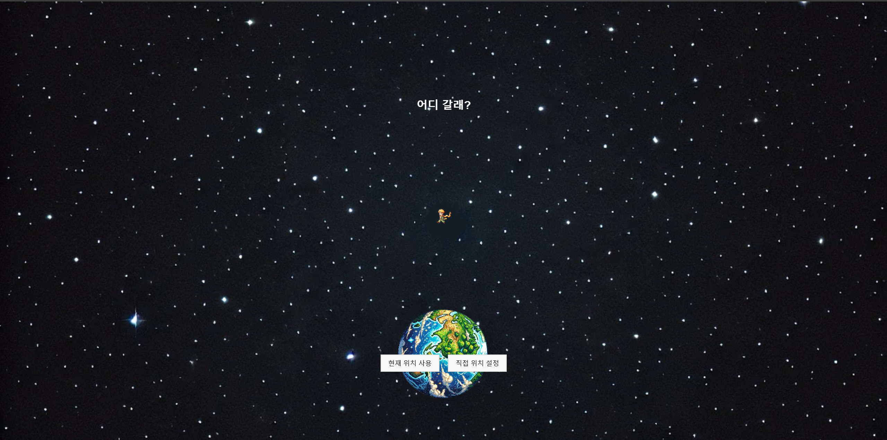

# 🌍 어디 갈래? - 스마트 여행 가이드  

**어디 갈래?**는 사용자의 현재 위치 또는 선택한 도시를 기반으로 **맞춤형 여행 정보**를 제공하는 웹 애플리케이션입니다.  
실시간 날씨, 주변 명소 검색, 유튜브 라이브 스트리밍 등을 활용하여 보다 스마트한 여행을 돕습니다.  


  


---

## 📌 주요 기능  

✔️ **실시간 날씨 정보 제공** (`OpenWeather API`)  
- 현재 위치 또는 선택한 도시의 기온, 체감 온도, 날씨 상태, 풍속 등을 표시  
- 습도, 풍속 등을 고려한 **옷차림 추천 기능** 포함  

✔️ **주변 명소 검색** (`Google Places API`)  
- 숙박, 음식점, 쇼핑, 야외 활동, 문화·예술 등 **13개 주요 카테고리**에서 장소 탐색  
- 장소별 평점, 주소, 운영 시간 등 제공  

✔️ **YouTube 실시간 스트리밍 검색** (`YouTube Data API`)  
- 현재 위치 반경 50km 내에서 **라이브 이벤트 검색**  
- 시청자 수 기준으로 정렬하여 인기 스트림 표시  

✔️ **문화·언어 팁 제공** (`REST Countries API`)  
- 여행하는 국가의 인구, 수도, 통화, 지역 정보 제공  
- 한국어/영어/중국어/스페인어 등 다국어 기본 회화 지원  

✔️ **사용자 맞춤형 위치 설정**  
- 현재 위치 자동 감지 (Geolocation API)  
- 직접 원하는 도시 선택 가능  

---

## 🛠️ 기술 스택  

- **Frontend:** HTML, CSS, JavaScript  
- **APIs:**  
  - [Google Maps API](https://developers.google.com/maps) - 지도 및 위치 정보 제공  
  - [Google Places API](https://developers.google.com/places/web-service/intro) - 장소 검색  
  - [OpenWeather API](https://openweathermap.org/) - 실시간 날씨 데이터 제공  
  - [YouTube Data API](https://developers.google.com/youtube/) - 라이브 영상 검색  
  - [REST Countries API](https://restcountries.com/) - 국가별 기본 정보 제공  
- **호스팅:** GitHub Pages  

---

## 🚀 실행 방법  

### 1. 로컬에서 실행  

```bash
# 프로젝트 클론
git clone https://github.com/yourusername/your-repository.git

# 프로젝트 디렉터리로 이동
cd your-repository

# index.html을 브라우저에서 열기
